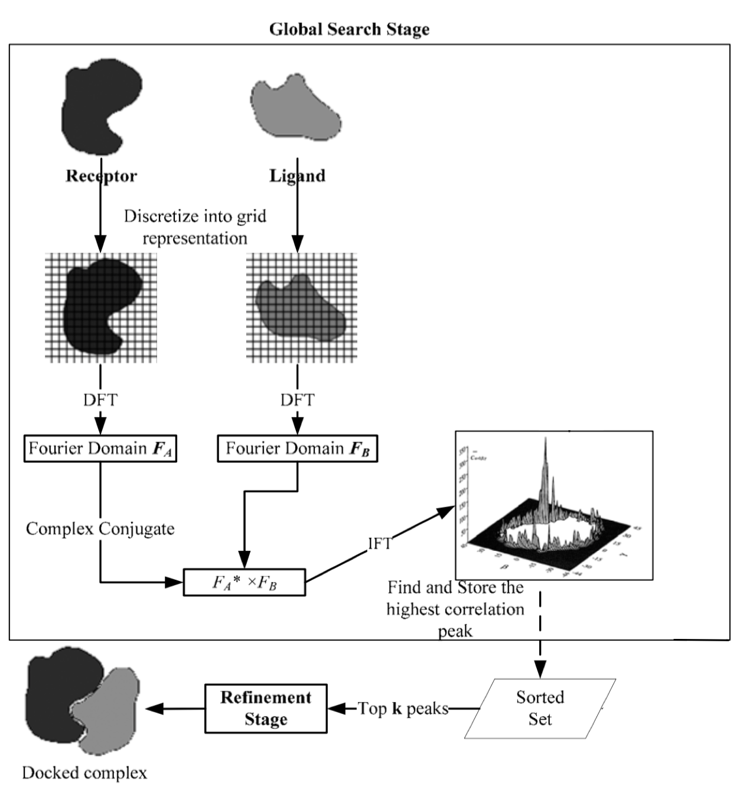

# 2017-2018_Equipe1 Scoring

**Scoring method for protein protein docking** developed by Guillaume Delevoye, François Gravey, Paula Milan Rodriguez, and Maxime Borry.

## Introduction

This scoring method uses the following steps:

- Fast Fourier Transform for filtering on Shape complementarity and Steric clashes


- Knowledge based scoring on amino-acids interactions
- Electrostatic and Van der Waals interactions scoring.

## Quick start

```pythonM
to complete
```

## Installation

### Environment - Conda

To ensure the cross-platform reproducibility of this method, we choose to work with a [conda](https://conda.io) environment.

The environment file is available here as [environment.yml](./environment.yml).

#### 1- create the environment from the environment.yml file

`conda env create -f environment.yml`

#### 2- activate the environment

`source activate meetu`

## Documentation

TODO

----

# Notes relevant for the team 1

## Documentation and docstrings

Please document your function using **docstrings**:
```python
def myfunction(input1, input2):
    """
        WHAT THIS FUNCTION IS DOING
        INPUT:
               input1(type) what is input 1
               input2(type) what is input 2
        OUPUT:
               result(type) what is result
    """
    result = input1 + input 2
    return(result)
```

## Project Management HOW TO
Go to projects Tab, click on `Scoring Soft` and add move tasks.  
Convert tasks to issues for opening a discussion about the tasks and/or assign people to it.

