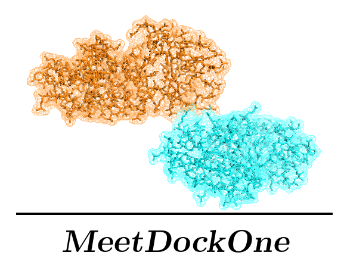

# MeetDockOne - Equipe1 Scoring


**MeetDockOne: a scoring method for protein protein docking**

## Authors:  
- Guillaume Delevoye  
- François Gravey  
- Ilyes Abdelhamid  
- Paula Milan Rodriguez  
- Maxime Borry  

## Introduction

This scoring method uses the following steps:

- Checking for shape complementarity and steric clashes.
- Knowledge based scoring on amino-acids interactions.
- Electrostatic and Van der Waals interactions scoring.
- Adjusting the weights of the different scoring functions by machine learning.

## Quick start

```
$ ./meetdock pdbfile.pdb
```

## Installation

### Environment - Conda

To ensure the cross-platform reproducibility of this method, we choose to work with a [conda](https://conda.io) environment.

The environment file is available here as [environment.yml](./environment.yml).

#### 1- create the environment from the environment.yml file

`conda env create -f environment.yml`

#### 2- activate the environment

`source activate meetu`

## Documentation

```
$ ./meetdock -h
usage: MeetDockOne [-h] [-shape] [-electro] [-jones] [-proba] [-foldx]
                   [-pH PH] [-depth DEPTH] [-dist DIST]
                   pdbfile

MeetDockOne scores a protein complex docking

positional arguments:
  pdbfile       .pdb complex file

optional arguments:
  -h, --help    show this help message and exit
  -shape        compute shape complementarity
  -electro      compute Electrostatic interactions
  -jones        compute Lennard-Jones interactions
  -proba        Compute knowledge based interactions
  -foldx        Scores with FoldX
  -pH PH        pH for electrostatic interactions. Default = 7
  -depth DEPTH  Threshold for surface residue determination (Angstrom).
                Default = 4
  -dist DIST    Threshold for interface determination (Angstrom). Default =
                8.5
```
