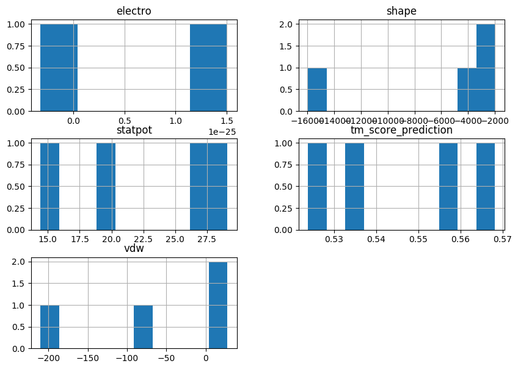

# MeetDockOne: a scoring method for protein protein docking


---

## Authors:  
- [Guillaume Delevoye](https://github.com/GDelevoye)  
- [François Gravey](https://github.com/fgravey)  
- [Ilyes Abdelhamid](https://github.com/IlyesAbdelhamid)  
- [Paula Milan Rodriguez](https://github.com/PaulaMilanRguez)  
- [Maxime Borry](https://github.com/maxibor)  

## Introduction

This scoring method uses the following steps:

- Checking for shape complementarity and steric clashes.
- Knowledge based scoring on amino-acids interactions.
- Electrostatic and Van der Waals interactions scoring.
- Adjusting the weights of the different scoring functions by machine learning.

## Dependancies

- [Conda](https://conda.io/docs/)

## Download

#### 1- download the latest release of MeetDock [here](https://github.com/meetU-MasterStudents/2017-2018_Equipe1/releases/latest)

#### 2- decompress the `.zip` file

`unzip 2017-2018_Equipe1-*`

#### 3- go to MeetDockOne folder

`cd 2017-2018_Equipe1-*`

## Installation

### A- Environment - Conda

To ensure the cross-platform reproducibility of this method, we choose to work with a [conda](https://conda.io) environment.

The environment file is available here as [environment.yml](./environment.yml).

#### 1- create the environment from the environment.yml file

`conda env create -f environment.yml`

#### 2- activate the environment

`source activate meetu`

#### 3- solvant accessible surface (optional)

The default method to compute the solvant accessible surface is [msms](http://mgltools.scripps.edu/packages/MSMS).  
However, it is **really slow** and will **not work for big complexes, but it will run out of the box** and is included in *MeetDockOne*.  

To solve this issue, it is also possible to run *MeetDockOne* with [Naccess](http://wolf.bms.umist.ac.uk/naccess/) (see Documentation section of this readme), a faster and more reliable method.  
To do so, you will first need to install Naccess yourself.

The compilation of Naccess requires a Fortran compiler.

**Ubuntu/Debian Linux**
- `sudo apt-get install gfortran`  
- `csh lib/NACCESS/install.scr`  
- `cp lib/NACCESS/* /usr/local/bin`  

**OS X**
- Download and install the fortran compiler for your system [here](https://gcc.gnu.org/wiki/GFortranBinaries#MacOS)
- `csh lib/NACCESS/macinstall.scr`
- `cp lib/NACCESS/* /usr/local/bin`  

## Quick start

```
(meetu)$ ./meetdock  path/to/meetdock/data -recChain A -ligChain B -shape -electro -jones -proba
```
- The dictory `path/to/meetdockone/data` contains pdb complexes to score.  
- The receptor is Chain A (`-recChain A`).  
- The ligand is Chain B (`-LigChain B`).  
- The following methods will be computed on the complexes :    
    - shape complementarity (`-shape`)
    -electrostatic energy (`-electro`)
    - Leenard-Jones interactions (`-jones`)
    - A knowledge based scoring function (`-proba`)

## Output

- `MeetDockOne_results.csv`: a .csv file summarizing your results, sorted by decreasing predicted Tm score.
    - **pdb**: name of the pdb file
    - **electrostatic**: Electrostatic energy
    - **shape**: Shape complementarity, similar to [Chen et al.](http://dx.doi.org/10.1002/prot.10092)
    - **vdw**: Van der Waals interactions
    - **tm_score_prediction**: Predicted Tm score with our Machine learning model
    - **interpretations**: Tm score > 0.8 Excellent || 0.8 > Tm score >= 0.6 Moyen || 0.6 > Tm score >= 0.4 Passable || 0.4 > Tm score mauvais

**Example**:

| pdb      | electro                 | shape    | statpot            | vdw                 | tm_score_prediction | interpretations |
|----------|-------------------------|----------|--------------------|---------------------|---------------------|-----------------|
| 4LW4.pdb | 1,2875610561314053e-25  | -15964,0 | 26,619999999999997 | -210,20280214660673 | 0,5681633333333332  | passable        |
| 2za4.pdb | 1,5077200870763863e-25  | -1982,0  | 29,1               | 21,831874052394138  | 0,5578466666666666  | passable        |
| 4H03.pdb | -3,2388259307234537e-26 | -3307,0  | 19,75              | 27,762327090226467  | 0,5353899999999999  | passable        |
| 2IDO.pdb | -0,0                    | -4082,0  | 14,41              | -81,43243931391687  | 0,52383             | passable        |


- `MeetDockOne_results.png`: a plot of the different scores distributions

**Example:**




## Documentation

```
(meetu)$ ./meetdock -h
usage: MeetDockOne [-h] [-shape] [-electro] [-jones] [-proba] [-outdir OUTDIR]
                   [-recChain RECCHAIN] [-ligChain LIGCHAIN] [-depth DEPTH]
                   [-pH PH] [-dist DIST] [-thread THREAD]
                   pdbpath

MeetDockOne scores a protein complex docking

positional arguments:
  pdbpath             absolute path to pdb complex directory

optional arguments:
  -h, --help          show this help message and exit
  -shape              compute shape complementarity
  -electro            compute Electrostatic interactions
  -jones              compute Lennard-Jones interactions
  -proba              Compute knowledge based interactions
  -outdir OUTDIR      path to (existing) output directory
  -recChain RECCHAIN  receptor Chain ID. If there more than one, separate by a
                      ','. Default = 'A'
  -ligChain LIGCHAIN  ligand Chain ID. If there more than one, separate by a
                      ','. Default = 'B'
  -depth DEPTH        Method for residue depth/solvant accessibility. [msms |
                      naccess]. Default = msms
  -pH PH              pH for electrostatic interactions. Default = 7
  -dist DIST          Threshold for interface determination (Angstrom).
                      Default = 8.5
  -thread THREAD      Number of threads for MultiThreading. Default: automatic
                      detection
```
